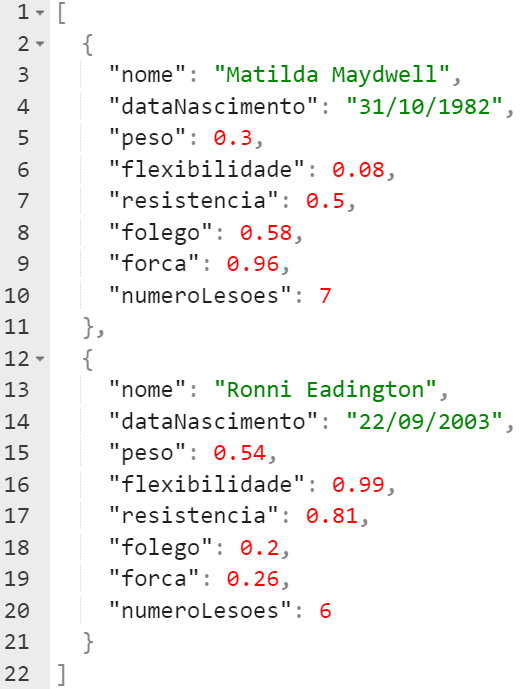

Trabalho 2 - Disciplina de Introdução a Programação Orientada a Objetos
Curso de Graduação em Sistemas para Internet - UTFPR TD.

DESCRIÇÃO: arquivo original [aqui](pdf/trabalho2.pdf)
Introdução à Programação Orientada a Objetos (TSI32A)
Professor: Ivan Luiz Salvadori
Trabalho 2
Atenção: Esta atividade será avaliada e corresponderá nota de acordo com o plano de ensino da disciplina.

1. Escreva um programa em Java capaz de simular competições entre atletas de três modalidades distintas, sendo elas:
- Ginástica
- Natação
- Halterofilismo

Os atletas possuem diferentes atributos que definem o seu desempenho na competição. Os atributos considerados são:

-peso

-flexibilidade

-resistência

-força

-fôlego

Além dos atributos, atletas podem possuir lesões decorrentes de seus treinamentos e competições anteriores. A quantidade de lesões interfere negativamente no desempenho dos atletas.
O desempenho dos atletas são simulados por fórmulas que consideram os atributos dos atletas em cada modalidade. O cálculo para cada modalidade deve ser realizado da seguinte forma:

Desempenho dos ginastas:
d = 1 + (força * 0.6) + (resistência * 0.6) + (fôlego * 0.5) + (flexibilidade * 1.0) – (peso/100) - (nrLesões/10)

Desempenho dos nadadores:
d = 1 + (força * 0.5) + (resistência * 0.6) + (fôlego * 1.0) + (flexibilidade * 0.3) – (peso/100) - (nrLesões/10)

Desempenho dos halterofilistas:
d = 1 + (força * 1.0) + (resistência * 0.6) + (fôlego * 0.4) + (flexibilidade * 0.3) + (peso/100) - (nrLesões/10)

As listas dos atletas estão disponíveis por meio de três arquivos JSON distintos. Cada arquivo contém os atletas que irão participar de cada uma das modalidades esportivas. O exemplo aseguir ilustra o conteúdo do arquivo:

Os atletas contidos nos arquivos devem ser inscritos nas suas respectivas competições, sendo necessário cumprir os seguintes requisitos:

-Atletas entre 18 e 45 anos de idade (calculado no momento da simulação)

-Não possuírem mais de 10 lesões

Os atletas que cumprem os requisitos são incluídos na competição. Entretanto, os atletas não admitidos deverão ser excluídos da competição. Ao término da simulação, o programa deve gerar um arquivo JSON para informar o resultado de cada modalidade. O nome do arquivo deve obedecer o seguinte padrão: resultado-\<modalidade\>.json. Os atletas que não cumprem os requisitos para participar das competições também devem ser registrados em um arquivo JSON, que deve ser nominado pelo padrão: inscricoes-negadas-\<modalidade\>.json.

